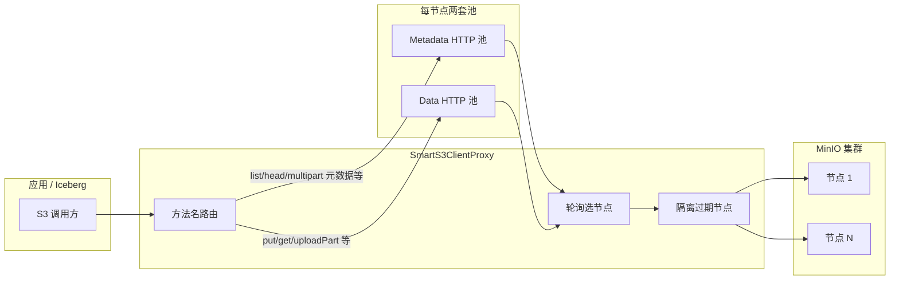

# has3a

面向 **多节点 MinIO / S3 兼容存储** 的 Java 客户端增强：**双连接池（元数据 / 数据）**、**按操作类型路由**，以及 **节点故障隔离与轮询容错**。可与 **Apache Iceberg** 的 `S3FileIO` 配合，通过自定义 `AwsClientFactory` 让表读写走同一套代理逻辑。

- **语言 / 构建**：Java 17，Maven  
- **核心依赖**：AWS SDK for Java v2（S3、`apache-client`）、Iceberg `iceberg-aws`

---

## 架构概览



| 组件 | 职责 |
|------|------|
| **BulkheadS3ClientFactory** | 为每个 endpoint 各建一对 `S3Client`（元数据池 + 数据池，Apache HTTP Client），组装成代理。 |
| **BulkheadClientConfig** | 连接池大小、超时、节点隔离 TTL 等可调参数（含 Builder）。 |
| **SmartS3ClientProxy** | JDK 动态代理实现 `S3Client`：按操作名选择 metadata / data 客户端；多节点轮询；失败节点临时隔离。 |
| **S3ClientMetrics** | 可选指标回调（默认可关闭）。 |
| **CdsIcebergS3ClientFactory** | 实现 Iceberg `AwsClientFactory`，从 catalog 配置解析 endpoint 列表并返回上述代理 `S3Client`。 |
| **S3V2Interceptor** | 与路径风格等相关的请求侧辅助（按需使用）。 |

---

## 使用方法

### 1. 直接构造 `S3Client`（应用内调用）

```java
import io.github.has3a.BulkheadS3ClientFactory;
import io.github.has3a.BulkheadClientConfig;
import software.amazon.awssdk.regions.Region;
import software.amazon.awssdk.services.s3.S3Client;

import java.net.URI;
import java.util.List;

S3Client s3 = BulkheadS3ClientFactory.createSmartProxy(
    List.of(URI.create("http://minio1:9000"), URI.create("http://minio2:9000")),
    "accessKey",
    "secretKey",
    Region.US_EAST_1,
    BulkheadClientConfig.builder()
        .dataMaxConnections(400)
        .quarantineTtlMillis(10_000)
        .build()
);
// 之后与普通 S3Client 一样使用（path-style，适合 MinIO）
```

需要指标时，使用带 `S3ClientMetrics` 的重载。

### 2. 在 Iceberg 中接入

在 catalog 属性中指定 S3 实现与工厂，并配置 endpoint 与凭证（属性名以 `CdsIcebergS3ClientFactory` 为准，常见项如下）：

| 属性 | 说明 |
|------|------|
| `client.factory` | `io.github.has3a.CdsIcebergS3ClientFactory` |
| `s3.endpoint.list` | 逗号分隔的节点 URL，例如 `http://host1:9000,http://host2:9000` |
| `s3.access-key-id` / `s3.secret-access-key` | 必填 |
| `s3.region` | 默认 `us-east-1` |
| `s3.pool.metadata.*` / `s3.pool.data.*` | 连接池与超时（详见工厂类 Javadoc） |
| `s3.proxy.quarantine-ttl-ms` | 故障节点隔离时间（毫秒） |

同时需设置 Iceberg 使用 AWS S3 文件 IO，例如 `CatalogProperties.FILE_IO_IMPL` = `org.apache.iceberg.aws.s3.S3FileIO`（与具体运行方式一致即可）。

---

## 构建与测试

```bash
./mvnw clean verify
```

部分测试依赖本机 **MinIO**（默认 `http://127.0.0.1:9000`，凭证与测试代码一致）。Windows 上跑 Iceberg + S3A 相关测试时，项目内已用 `fs.s3a.fast.upload.buffer=bytebuffer` 等方式降低对 Hadoop 本地 JNI 的依赖；若仍有环境问题，请检查 JDK 与 MinIO 是否可用。

---

## 许可证

以项目内声明为准（若未添加 LICENSE 文件，请自行补充）。
